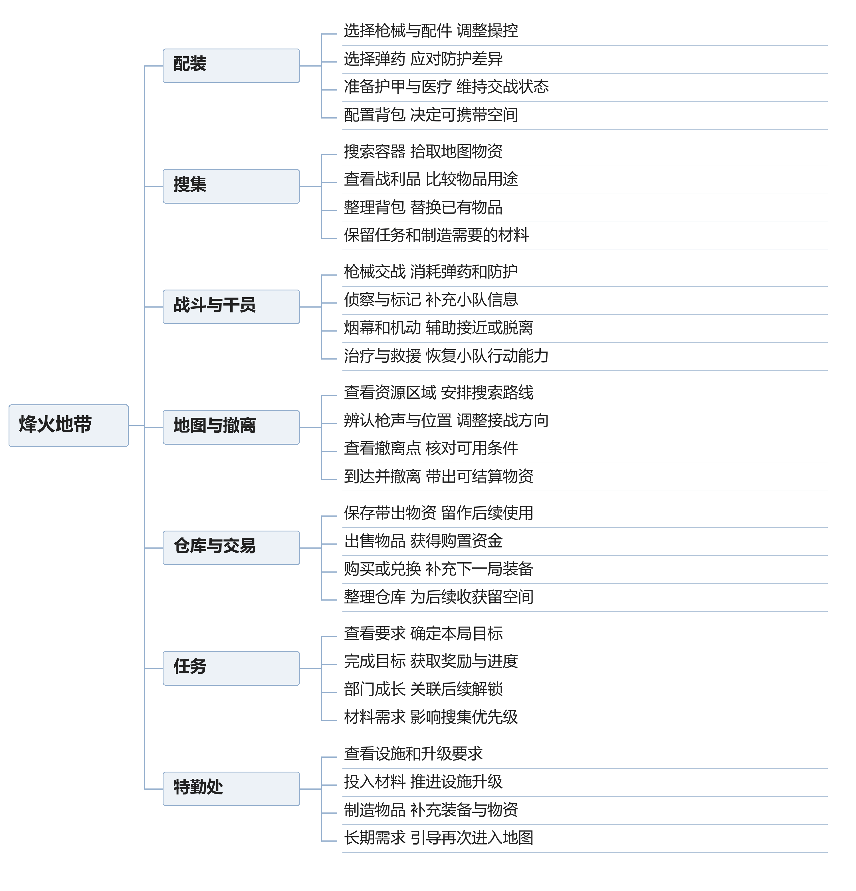

# 三角洲行动玩法分析

三角洲的烽火地带有一个很容易被忽略的变化：进图时，玩家希望找到值钱的东西；真正找到以后，玩家又开始担心下一场交火。东西还放在同一个背包里，但这一局想做的事已经变了。搜集、装备、干员和撤离之间的关系，值得从这个变化往下看。

本文主要讨论烽火地带。全面战场也使用干员与枪械，但它的据点目标、复活规则和大队伍作战，不能直接套进搜打撤的分析里。

## 一 系统和功能

图中按玩家操作整理主要功能。背包里的物资要经过撤离才能大量转入局外资产，任务和制造需求又决定下一次想搜什么，因此这些功能不能只按大厅菜单理解。

### 配装和仓库

仓库保存装备和带出的物品，配装界面把其中一部分交给本局角色使用。玩家需要准备武器、弹药、防护与医疗物资，也要考虑背包能装多少东西。枪械改装会影响操控和使用习惯；弹药与防护之间的关系，则会影响一次命中能造成多少实际伤害。[1]

这里至少有两种不同的选择。选一把更顺手的枪，是在改善操作；给同一把枪配什么弹药，是在决定这套装备准备应付什么对手。预算有限时，把钱都花在外观熟悉、配件齐全的枪上，未必能得到相应的交战优势。分析配装时应该把枪、弹和甲放在一起看，单看枪械面板容易漏掉真正的问题。

仓库还让玩家有了局外的回旋余地。一局损失以后，可以换用存货或降低下一局投入，而不用沿用刚才那套打法。这个余地越充足，玩家越有条件试新枪、走不熟悉的路线。反过来，当剩下的装备已经不多时，同样一次失败会更难接受。

### 地图搜集和撤离

玩家进入地图后，可以搜索容器、拾取物品、处理任务，也可能遭遇 AI 敌人和其他干员小队。撤离点把行动收束到地图上的具体位置，有些撤离点还附带条件。地图工具因此不只是导航，它也帮助玩家判断路线最后能不能走通。[1][2]

物品有出售、任务和制造等用途。于是，值不值得捡不能只看稀有度：一个售价普通、但恰好是当前升级缺口的材料，可能比另一件卖价更高的东西更值得保留。这种需求会让同一地点在不同阶段有不同吸引力。

背包容量把搜集变成了取舍。装不下以后，玩家需要腾格子、换物品或者结束搜索。整理背包本身还占用注意力；如果刚打完一场交火，周围是否安全没有确认，此时花时间比较战利品，就可能给后来者留下机会。这是物品管理与战斗发生联系的地方。

### 干员和小队

干员提供不同的技能组合。红狼偏向机动与突击，露娜提供侦察手段，蜂医有治疗及烟幕相关能力，牧羊人可以用声波装置干扰或防守。这些只是代表，不构成固定的最佳阵容。[3]

三人小队里的每个人都要开枪、搜集和撤离，职责不会像纯粹的治疗、坦克、输出那样完全分开。技能更像是在共同任务中补上一种手段：过开阔地缺遮挡，交战前缺信息，队友倒地后缺恢复与掩护。选干员时，应该先看小队打算怎样行动，再看有没有相应手段。

例如，一队人都喜欢抢先接战，队伍可能不缺第一轮进攻能力，却在交战结束后很难安全整理状态。增加支援能力能缓解这个问题，但代价是少一个其他类型的技能组合。人数限制让这种取舍有意义，也使熟人配合和临时组队呈现出不同难度。

### 任务 交易和特勤处

部门任务提供阶段目标及奖励，并与后续解锁发生联系；补给和交易让物资转成下一局能用的装备；特勤处的设施、制造与升级又会产生材料需求。[1][4]

如果只有出售赚钱，很多物品最后都可以被压成一个价格。任务和制造让物品保留了别的用途，也给缺乏自定目标的玩家一个出发理由。今天缺什么、准备去哪里找、值得带多好的装备，逐渐成为同一个问题。

代价也很明显。玩家必须记住更多东西，撤离之后还要处理仓库、交易和生产。喜欢搜集经营的人可能愿意做这些；主要想打枪的人则可能把它们当成两局之间的手续。不能因为局外功能很多，就认为它们必然更有深度。关键要看整理和积累有没有改变下一局的安排。

## 二 接触系统的顺序

下面按理解玩法的先后整理，不作为客户端教程或功能解锁顺序的记录。烽火地带的大量信息同时出现在大厅里，但新手没有必要一次学完。

### 先完成一次带东西离开地图的过程

第一步应当把配装、进图、搜索和撤离连起来。只要能明白哪些装备是自己带入的、哪些东西是刚捡到的，以及为什么必须走到撤离点，这个模式就有了基本轮廓。此时讲一大套高收益路线或毕业改枪，玩家往往还不知道这些建议解决什么问题。

首次路线可以选少量容易辨认的位置，提前看清撤离条件。重点不在这一局赚多少，而在于让玩家经历一次完整的前后对应：进图时背包空着，搜索后装入物品，离开后再把物品放进仓库。规则通过结果变得可见。

### 回到大厅后再理解物品用途

带出东西以后，再接触出售、保留材料和任务交付，物品分类才有实际对象。玩家会知道，刚才认为不值钱的材料为什么有人需要，也会发现仓库空间有限，所有东西都留着并不可行。

这一阶段适合给出一个明确需求，例如完成某项任务所需的物资。下一次进图就有了搜索方向。若先让玩家背完整物品表，再告诉他可以去地图里寻找，学习负担会大很多，也很难记住。

### 遇到交战问题后理解装备差异

能够撤离不等于能够稳定处理交战。接下来需要把命中、弹药、防护、治疗和位置联系起来。一次交火打不赢，可能是枪没打准，也可能是对手的防护、自己的弹药或暴露位置不合适。把这些原因都归结成枪不好用，会让后续花钱改装偏离问题。

这一阶段的学习重点应该是比较，而不是记结论：保持枪械不变，理解弹药选择的作用；保持装备不变，比较先暴露和先看到对手有什么差别。这样的练习才容易把一个具体结果和一个具体原因联系起来。

### 有了固定目标以后再做长期积累

当玩家愿意反复进入某张地图，任务、特勤处与装备储备才开始有较清楚的位置。他可以为了材料改一段搜索路线，也可以为了练习交战，专门准备能承担损失的装备。局外成长不再只是看着几个数值上涨，而是支持某种自己想做的事情。

干员配合也适合在这个阶段继续深化。先熟悉一个干员怎样保护自己，再理解同一技能什么时候能帮队友。烟幕什么时候封、侦察结果什么时候报、倒地后谁看住对手，都需要和小队的行动接上。提前背一套阵容名称，并不能代替这些配合。

## 三 核心玩法

### 搜到东西以后 为什么会想换一条路

假设一支小队原本准备去资源区。途中有人拿到当前急需的任务物资，又占用了安全箱以外的背包空间；前方这时传来枪声。继续前进可以争取更多收益，也可能丢掉已经拿到的东西。绕路撤离则会放弃原计划。这个假设局面可以用来说明选择如何变化。

物资获得之前，去资源区解决的是缺少收益的问题；物资获得以后，玩家还得解决怎样保住这次成果的问题。目标没有被系统强行切换，玩家却有理由主动改变路线。一次随机搜获就能改变后半局的打法，这比单纯增加一种容器更值得关注。

不过，不能把它简化成背包越贵就越该撤。还要看东西能否放进安全箱，是否需要成功带出，队友的目标是什么，以及眼前是否有安全路线。已经满足安全箱保护条件的物品，和仍然暴露在失败损失中的物品，对接战意愿的影响不一样。[1]

三个人的想法也未必同步。一个人已经拿到所需材料，另一个人可能还想完成击败目标的任务。小队需要商量继续还是离开。这个分歧让撤离决策有社交内容，同时也可能带来摩擦。只用全队背包总价值解释选择，会漏掉队员各自的目的。

我更认可把这种目标变化保留下来。地图若总能按同一条安全路线拿到相似收益，玩家就容易照着路线跑，途中得到什么都不影响决策。相反，如果所有好东西都逼着人去最拥挤的交火区，回避战斗又会失去可行性。两端都压缩了玩家自己选择的空间。

### 打赢一队以后 为什么还不能放松

烽火地带的一场交火会留下后续问题。小队可能需要治疗、补充弹药、救援队友；敌人的战利品又需要靠近检查。刚才的枪声可能吸引别的小队，当前人数和剩余状态却不再适合马上打一场同样强度的战斗。

于是，击败对手和拿走对手的东西之间，还隔着一段需要处理的过程。谁先补状态，谁观察周围，要不要把全部物品搜完，都影响这一战最后有没有产生收益。若所有队员同时打开背包，小队虽然在上一轮对枪中赢了，却把下一次接敌的准备丢掉了。

干员技能在这里有了不同于开团的用途。烟幕可以辅助转移或救援，侦察可以补充附近的信息，防守装置可以照看一条通道。但它们只能改善一部分条件。烟幕遮住视线，也让己方更难看清烟内外的活动；侦察反馈需要结合范围和时机理解；装置覆盖的方向以外仍然可能来人。

这也是我认为干员分析应放回完整对局的原因。如果只比较正面遭遇时谁更容易击倒对手，治疗、掩护和暂时守住侧后的价值很容易被低估。另一方面，支援技能若能在每场交火后轻易抹掉状态损失，前一场战斗付出的代价又会变轻。支援强度与连续接战的频率应当一起看。

### 装备积累让人想再开一局 也可能让人不敢出门

撤离所得能转成装备、物资和后续准备，玩家可以感受到上一局留下的东西。比起每次重新发同一套武器，这种连续性更容易形成个人目标：攒一套装备、补齐制造材料，或者留几套低成本配置专门练图。

但连续性同时意味着亏损也会留下。玩家把装备看得越重，越可能不愿意承担试错。最终出现一种矛盾：积累本来是为了获得更多行动选择，实际却可能变成只愿意用最便宜的装备，最好的东西一直放在仓库里。

配装券和任务奖励能缓解重新出发的压力，却不能自动解决这个矛盾。[1] 如果玩家连失败原因都看不懂，再送一套装备，也只是让他再经历一次无法解释的损失。我会更看重两件具体的事：重新准备一局是否足够方便，以及交战反馈能否帮助他区分操作失误与装备差距。

成长目标也不宜只剩仓库总价值。对于练枪的人，能更从容地处理一次遭遇就是进步；对于任务玩家，带出缺失材料可能比多赚一笔钱更有意义。任务和搜集系统提供多种目标，前提是不同目标真的能安排出不同的路线和投入，而不只是把同一场战斗换几个奖励名称。

### 干员的取舍应当给对手留下办法

有技能之后，小队可以用较明确的方式补信息、掩护移动和争取进攻机会，协作内容比单纯交换装备更多。不过，技能让己方减少风险时，也可能在减少对手能做的事。

例如，用装置封住一条窄路，如果对方能通过声音辨认、发现后处理，或者付出绕行代价换一条路，装置就会产生取舍。如果只能在毫无预警的情况下吃到控制，这种体验更接近被规则处罚。官方曾在牧羊人的历史调整中增大声波陷阱的可听范围，并明确提到希望对手有更多反制空间。[5]

这条历史改动值得引用，因为它具体说明了平衡可以改哪里：不一定先减伤害，也可以让对方更早察觉。对搜打撤而言，这一点尤其重要。无法理解的一次失败，影响的不只是一场对枪，还包括带入的装备和刚搜到的物资。

我对烽火地带的判断是：它最有意思的部分，在于搜集所得、队伍状态和个人目标会一起改变下一步行动。干员系统应当为这些行动提供不同办法。分析一个技能好不好，最终还是要回到具体局面：它让小队多做了什么，对手还能怎样应对，使用后又留下什么问题。

### 参考资料

[1] Garena Delta Force，Operations Mode 101，2026-02-20。基础规则参考，未采用移动端声音指示器描述。https://deltaforce.garena.com/en/news/system/RMDWVM

[2] Delta Force 官方地图工具。文中假设局面不对应某张地图的精确路径。https://www.playdeltaforce.com/act/mapswiki/?lang=en

[3] Garena Delta Force 官方干员介绍。用于代表干员的能力方向，不作为当前版本强度结论。https://deltaforce.garena.com/en/?redirect=0

[4] Delta Force 官方工具站。包含配装、地图及特勤处制造等入口。https://www.playdeltaforce.com/events/hq/en/

[5] Garena Delta Force，2025-07-08 更新公告。牧羊人声音提示的历史设计案例，不代表现行数值。https://deltaforce.garena.com/en/news/announcement/V6J38U
