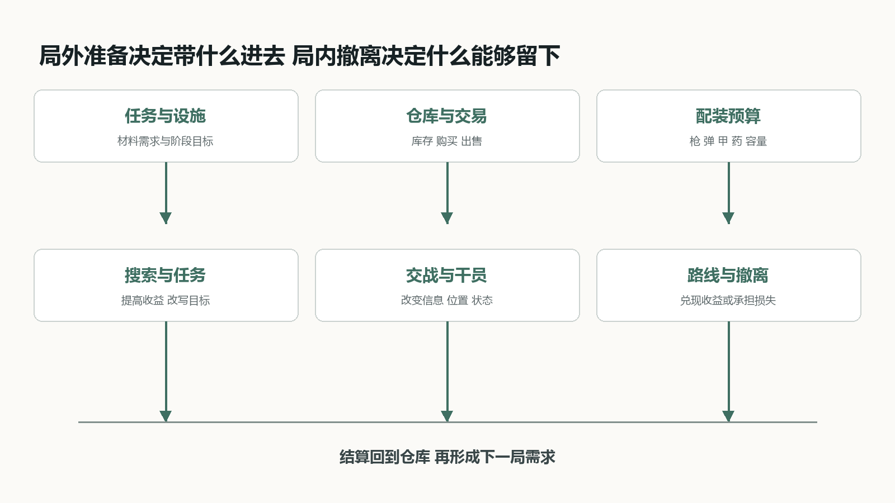
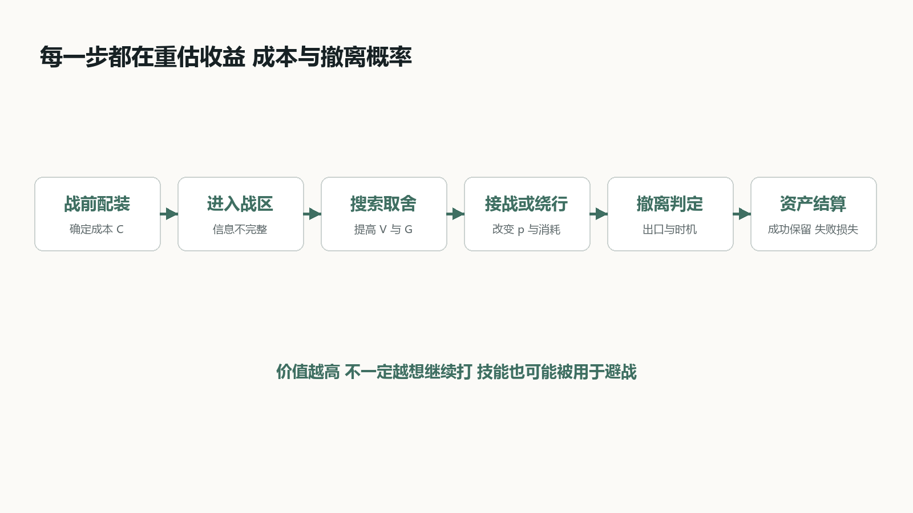
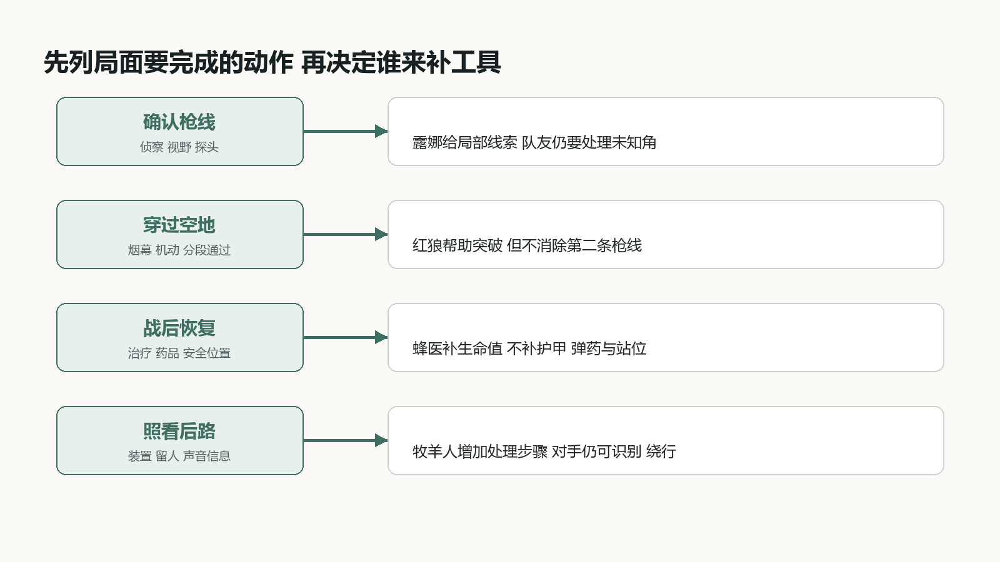
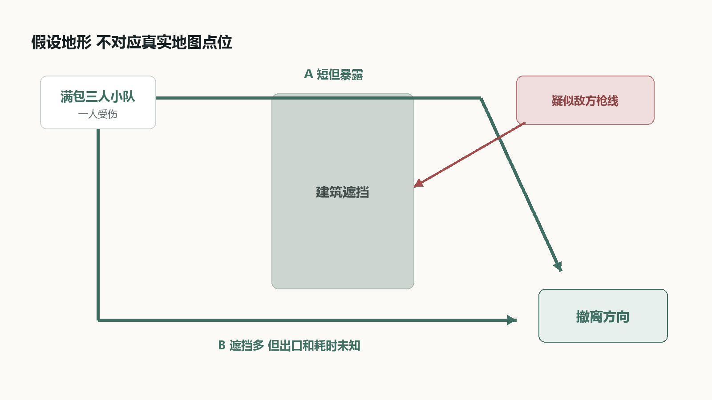

# 三角洲行动烽火地带玩法系统分析

从一套配装到一次撤离 干员小队如何进入搜打撤决策

## 01 游戏概览与分析口径

《三角洲行动》的烽火地带不是把击杀数写在结算页上的普通团队射击。玩家带着自己的装备入场，在地图里搜集物资、处理任务、遭遇玩家与 AI，最后还要抵达可用撤离点。带出去的东西才真正进入仓库；倒在地图里，大部分本局所得和带入装备都会失去，安全箱中的物品除外。[D0]

这份分析不做全功能百科，也不追逐当前版本强度榜。我更关心一个贯穿整局的问题：当背包价值、队伍状态和撤离条件不断变化时，玩家为什么继续搜、为什么接战、又为什么突然决定离开。干员系统放在这条决策链里观察，才能看出侦察、突破、支援和布防在搜打撤中与大战场不同的用法。

文章按四层展开。先看局内外系统怎样闭环，再拆配装、搜索、战斗和撤离；随后用四名代表干员观察三人小队的职能组合；最后用一个满包撤离局面和反事实比较检验结论。官方资料只支持规则事实，概率、路线和方案均标为本文推演。

## 02 系统全景 一局如何同局外相连

从菜单看，仓库、任务、交易、特勤处和配装是不同入口；从玩家行动看，它们共同回答同一件事：下一局为了什么出发，又愿意押上多少成本。部门任务和设施升级制造材料需求，仓库提供库存，交易与补给把物资换成可用装备，配装再把其中一部分送进战局。[D0]

局内的搜索、交战和撤离不是三段互不相干的流程。搜索提高潜在收益，也增加停留时间和背包管理负担；交战可能夺得物资，也可能损失整套投入；撤离点把分散的路线重新压向少数出口。只要其中一环不成立，循环就会改变：搜到却带不出，收益没有兑现；有钱却不敢带装备，局外积累没有转成新的行动能力。

因此，系统分析不应只列“有什么功能”，还要标出资源从哪里来、在哪一步承担风险、何时完成结算。下图把核心闭环分成局外准备、局内决策和局后结算三层。

图 烽火地带局内外系统全景。图中关系为本文归纳，不是客户端内部架构。

## 03 核心循环 撤离才是价值兑现

把背包价值放进判断后，提升撤离概率的技能可能比增加本轮伤害更有用，但这个结论有条件。设 V 为当前仍可能损失的携带价值，G 为继续行动可能得到的额外收益，C 为新增弹药、治疗和时间成本；现在离开的成功率为 p0，继续后的成功率为 p1。忽略安全箱收益与个人风险偏好，继续需要满足 p1(V+G)-C > p0V。

用任意单位演算：轻装时 V=20，继续可得 G=20、成本 C=4；满包时 V=80，其余不变。若 p0=95%、p1=75%，轻装继续的期望为 26，高于立即撤离的 19；满包继续只有 71，低于立即撤离的 76。若技能和队伍状态把 p1 推到 85%，满包继续才翻到 81。概率全是假设，这个模型不是胜率计算器，只用来说明同一个技能在不同背包状态下会有不同价值。

真正的核心循环因此不是“搜到人就打”，而是不断重估：当前收益是否值得继续暴露，队伍还有没有处理下一次意外的余量，撤离路线是否仍然可行。击杀是改变这些条件的手段，撤离才是把战局结果写回局外资产的结算。

图 从配装到结算的风险收益循环。图中关系为本文归纳，不是客户端内部架构。

## 04 配装系统 成本写在进图之前

配装把战术选择和损失绑定在一起。枪械与配件影响操控和适用距离，弹药与护甲关系影响有效击杀效率，医疗品处理生命与异常状态，胸挂、背包和安全箱则规定可携带空间与保底范围。[D0] 玩家不是在选一件最强装备，而是在决定本局准备处理什么局面，以及失败时能接受失去多少。

高投入并非单纯提高胜率。它一方面提高正面交战上限，另一方面抬高沉没成本，可能让玩家更早避战。低投入也不是纯粹吃亏：便宜配置允许更大胆地试路线、练枪或完成低价值任务，但面对高防护对手时容错更低。装备的设计价值来自这组同时存在的收益与压力。

配装券和任务奖励相当于重新出发的缓冲。它们降低一次失败之后的恢复成本，却不能替玩家解释为什么失败。若交战反馈无法区分枪法、弹药、防护和位置问题，再送一套装备只会重复一次不明不白的损失。

## 05 搜索与背包 每次拾取都在改写路线

搜索的深度不只来自物品种类，而来自“装不下”和“用途不同”。一件物品可能用于出售、任务交付、设施升级或制造。卖价较低但恰好填补当前材料缺口的物品，会改变玩家对它的优先级；背包已满以后，继续搜索变成替换，而不再是无成本增加。[D0]

背包管理还会占用时间和注意力。刚结束交火时打开战利品界面，意味着暂时减少对周围声音和路线的处理。小队如果三个人同时搜尸，上一场战斗虽然获胜，下一场接敌的准备却被主动放弃。因此，“谁先搜、谁警戒、搜多久”本身就是战斗后的团队分工。

更关键的是目标会在拾取后翻转。空包时，高价值区解决的是“我还没有收益”；拿到任务物资或稀有物品以后，同一片区域变成“它还可能夺走现有收益”。优秀的搜打撤地图会允许玩家因此换路、提前撤或继续加注，而不是只提供一条固定刷取路线。

## 06 地图信息与撤离 结束点反向塑造路线

地图里的资源区、通路、掩体、出生点和撤离点共同组织交战密度。高价值标记提高搜索吸引力，也让多支小队可能朝同一位置靠拢；枪声、脚步、开门痕迹和被清理的 AI 则把其他玩家的行动留在环境里。信息不会直接给出答案，只会改变某条路线的可信度。[D0]

撤离点不是放在地图边缘的结束按钮。固定、条件、付费或需要触发的出口，会反向影响配装、携带物资和剩余时间。越接近关局，分散在地图中的队伍越可能被少数可用出口重新汇聚，原本安全的路线也会因为时间压力变成必经之路。

这使得“最短路线”和“最安全路线”很少完全重合。短线减少暴露时间，却可能经过已知枪线；侧路利用遮挡，却增加未知出口与超时风险。干员技能只有接到具体通路、队友位置和剩余时间上，才会形成真正的路线选择。

## 07 三个人不必凑齐四种职能

三人小队与四类职能制造了选择空间，但“少一个职能”不等于“必然缺一项能力”。要检查的是具体工具。

### 先列任务，不先填职业格

一条路线可能要求确认远处枪线、穿过出口、处理受伤队友，再阻止追击。应先问队伍需要完成哪些动作，再看技能、携带道具和路线能否一起覆盖。红狼自己有烟雾，蜂医也不只会抬血。

### 重叠不一定浪费

两人都能遮挡视线，可以轮流服务去程和回程。反过来，选了三个不同职能，也可能都无法处理某个高点。能力是否重叠必须结合使用时机和作用位置判断。

### 代价要写出来

偏突破的小队可能更容易抢出一段空间，却要用药品和保守路线补恢复缺口；偏撤离的小队可能更容易处理战后状态，却不适合追着敌人连续换点。这里比较的是任务适配，不是预设哪个阵容更强。

图表：四个代表样本，按主要用途归纳

|样本|优先处理|队伍仍需解决|
|---|---|---|
|红狼 / 突击|短时突破与追击|前方是否还有第二条枪线|
|露娜 / 侦察|缩小敌位不确定性|谁能在信息有效时行动|
|蜂医 / 支援|受伤后的恢复|弹药、护甲与安全位置|
|牧羊人 / 工程|限制入口与追击|敌人是否换路或远距处理|
|普通道具 / 站位|补足部分功能|数量、花费与操作机会|

阵容分析应落到“这个局面由谁处理”。只列突击、侦察、支援、工程四个标签，不足以说明小队配合。

来源：D1、D2、D3

图 三人小队的任务缺口与工具补位。图中关系为本文归纳，不是客户端内部架构。

## 08 露娜：探到人之后，队伍才开始做决定

信息技能的直接产物是线索，后续收益取决于它是否赶得上小队的行动。探到人也可能意味着该换路。

### 事实与分析分开

官方历史公告确认露娜探测工具在 Operations 有独立调整，并曾影响被探测目标的治疗物品冷却。本文不沿用其旧冷却值描述当前国服，也不把她的判定方式等同于 Sova。

### 信息不是无限保鲜

假设技能确认右侧有人，队友却仍在楼内搜物资。等三人重新集合，这个线索可能已不支持立即前压。此时应重新确认路径，不能因为刚才出现过标记，就把整片区域当成持续受控。

### 空结果尤其容易误读

没有反馈，只能说明本次没有得到目标信息。覆盖位置、敌人移动与技能规则都会影响结果。若要把“没探到”升级成“能安全通过”，还需要视野、听声或队友站位来补证。

图表：同一次探测可能导向不同选择

1. 确认一处敌位：只获得局部线索

2. 队友能立即跟进：压迫该位置，或趁另一侧空档通过

3. 队友距离过远：保留警戒，不能直接前压

4. 收益已足够：利用敌位选择绕行，不追求击杀

应记录探测后的路线、时机和接战变化。单独统计探测人数，很难区分有用的信息与没有被利用的信息。

来源：D2

## 09 蜂医：恢复生命值，不等于恢复全部战斗力

治疗后的队伍是否适合再打一波，要同时看状态、位置和下一次接敌时间。血条回满只是其中一项。

### 一次历史改动说明了什么

Starfall 公告把 Operations 的治疗手枪和治疗烟雾的治疗效果持续时间由 20 秒改为 60 秒。它延长了作用时间，但不能据此推导总治疗量提高三倍，更不能外推为现在所有地区的技能参数。

### 战后决策仍然有缺口

假设队伍击退对手，却有人弹匣接近空、护甲状态差。即使治疗解决生命值问题，也不应默认其他资源同步恢复。需要先决定是搜尸补给，还是趁敌方增援未到赶快离开。

### 治疗也有位置成本

聚在一处方便支援，却可能把三个人留在暴露区域。小队若为吃满治疗错过换位时间，账面恢复量会很好看，结果却更差。分析支援贡献时，应把接受治疗后的暴露时间一起看。

图表：同样接受治疗，后续选择可以相反

|场面条件|倾向选择|原因|
|---|---|---|
|安全掩体 / 弹药足|恢复后再评估|有机会继续行动|
|敌方位置未知|先迁移到遮挡处|避免停留换来新受击|
|护甲或弹药不足|补给或撤离|治疗没有解决全部缺口|
|撤离窗口紧迫|够用就走|多停留的成本高于额外恢复|
|队友分散|先协调集合位置|治疗可达性本身有要求|

更值得问的是“治疗是否让队友完成了原本做不到的移动或接战”，而不是把治疗量直接当作最终贡献。

来源：D2

## 10 红狼：第一次击倒改变后续推进成本

红狼适合用来观察正反馈。首个成功可以改善下一次接战条件，但它也容易诱使使用者追过安全边界。

### 技能组的衔接

官方基础介绍中，动力外骨骼提供短时移动和射速提升；击倒敌人可恢复生命与体力并延长状态。烟雾和滑铲为突破提供操作手段。这里关注条件反馈，不引用具体加成比例。

### 为什么会越打越想追

第一次击倒后，剩余技能时间与状态得到补充，继续压迫看起来更划算。但被击倒的只是一个目标，第二名敌人的枪线并未自动消失。技能奖励的局部成功，可能与小队的撤离目标产生冲突。

### 评价时要拆开两个问题

先看爆发窗口是否让突破发生，再看击倒后的恢复是否让推进过于连续。若问题出在第二段，一起削弱启动能力会损伤干员最清楚的用途。优先定位触发条件、延长收益及重新接战间隔，才能知道该调哪一段。

图表：正反馈与退出条件

1. 开启外骨骼：承担接近目标的风险

2. 取得第一次击倒：恢复与延长，提高继续行动吸引力

3. 重新检查局面：队友距离、第二条枪线、撤离收益

4. 继续或停止：有支援才压；状态奖励不能代替判断

评价滚雪球机制时，要看成功奖励有没有抹掉下一次风险，而非只看一次技能造成多少伤害。

来源：D1

## 11 牧羊人：让对手有机会识别陷阱，是平衡的一部分

部署物即使没有完成击杀，也可能通过迫使敌人停步、绕行或处理装置，给撤离方争取距离。

### 可核对的历史案例

2025 年 7 月的 Garena 公告将声波陷阱最大声音传播距离从 7 米改为 8 米。官方说明强调更清楚的警告与反制，同时保留防守用途。这是提示信息的调整，不是单纯削伤害。

### 为什么反制不会让它失去意义

追击方听到提示后可以减速处理，也可以改走另一边。只要这改变了追击节奏，防守方仍可能获益。反之，若装置没有提示、又让人难以应对，受害者就很难从失败中学到下一次该怎样处理。

### 不能把绕路时间写成硬控制

地图若有很近的平行入口，对手可以几乎不付代价地绕过。陷阱的价值因此取决于部署点与路线结构。没有录像和路径记录，不能把一次“敌人没有追上”都归因于部署物。

图表：反制链：任何一段断掉都影响体验

|环节|使用方想要什么|对抗方需要什么|
|---|---|---|
|发现|保持部署隐蔽性|在受罚前有可识别提示|
|判断|让敌人犹豫|知道大致威胁来自哪里|
|行动|拖慢通过速度|能处理、等待或换路线|
|结果|拉开距离或守住入口|理解为什么通过成功或失败|
|复盘|识别有效部署点|把失败转成下一次选择|

“能被反制”不是装置失效。可识别的威胁仍然能改变对手路线，也更适合让玩家学习。

来源：D3

## 12 局面推演：满包小队要不要穿过开阔地？

设定：三人已完成本轮搜集；一人受伤，右前方疑似有人，前方有直达路和侧路。图为自绘假设地形，不对应真实地图点位。

### 直达路的条件

距离短，但必须穿过高点可能覆盖的空地。先确认疑似枪线；若信息支持通过，再用遮蔽衔接两段掩体。第三人负责看后方，不应三个人都盯同一个标记。

### 侧路不是免费安全

侧路遮挡较多，却经过狭窄出口，也需要更多时间。若原路已被追击，侧路出口不明，绕行可能把正面的显性威胁换成出口的未知威胁。治疗应安排在遮挡内，而不是让队伍停在转角中央。

### 决定改变的信号

若前方确认多人架枪且侧路有队友视野，倾向绕行；若时间不足，直达路又有明确遮蔽窗口，可组织分段通过。这里没有必胜技能顺序，关键是每次拿到新线索后更新选择。

图表：路线 A 短而暴露；路线 B 长但出口未知

技能服务的是通过危险区这个任务。把“先探、再烟、再冲”写成固定连招，会漏掉应该撤回或换路的情况。

来源：本文模型 / 假设推演

图 满包撤离的两条假设路线。图中关系为本文归纳，不是客户端内部架构。

## 13 拿掉一个工具，才能看清它原来解决什么

保持上一节的假设地形和目标不变，只改变工具配置。这样可以检查阵容分析是否只是给技能贴好听的标签。

### 比较方法

表中不是实际禁用技能实验，也没有声称胜率变化。它是逐项移除工具的推演：其他条件尽量不变，再列出小队必须付出的替代成本。能被普通行为补上，不等于该技能没有价值。

### 替代与不可替代

没有侦察，可以靠探头和站位获得线索，但暴露成本更高；没有支援，可以带药，代价是携带与使用成本。不能因此得出某个干员必须上场，因为路线、装备和玩家配合也能补足缺口。

### 一条可被推翻的判断

若在相近地图、物资和水平条件下，满包队并没有更多利用信息与遮蔽避战，本文“携带收益改变技能用途”的判断就需要收窄。它可能只适用于协作较好、并以撤离为首要目标的小队。

图表：移除工具后的成本转移

|移除什么|可能替代办法|新增成本|
|---|---|---|
|侦察工具|逐段看角 / 队友架视野|时间与身体暴露|
|恢复工具|消耗药品 / 提前撤离|物资、操作时间或少搜一段|
|突破工具|等机会 / 换入口|放弃短时压迫机会|
|布防工具|留人看后路|正面可用人数减少|
|队友沟通|依赖标记与默认习惯|反馈慢，工具难以衔接|

只证明技能“有用”还不够。要指出不用它会增加什么成本，以及这些成本能否通过别的办法承担。

来源：本文模型 / 假设推演

## 14 双模式平衡，先分目标，再分参数

同一技能进入不同模式，面对的损失结构、交战频率和目标都不同。共用表现不要求所有参数共用。

### 同一名称不代表同一收益

全面战场围绕据点与持续战线组织战斗；烽火地带还要考虑携带收益的兑现。一次治疗、一次位移在两种循环中的使用频率和机会成本不同，因此不能用一边的体感直接判另一边强度。

### 历史证据的用法

表中保留地区、模式和改动方向，用来证明开发者确实分别处理技能效果。它不证明这些旧数值在当前国服仍生效，也不证明改动后平衡已经成功。分析依据是约束差异，不是把旧公告当现行攻略。

### 分开调也有代价

模式专属变化过多，会提高记忆负担。同一干员最好保留稳定的使用意图，再针对特定环境调整效果或参数；若操作逻辑也发生差异，界面与训练说明需要让玩家提前知道。

图表：Starfall 历史样本 / Garena / 2025-01

|对象|模式专属调整|能支持的结论|
|---|---|---|
|蜂医|Operations 治疗效果 20s → 60s|恢复作用时间按模式处理|
|露娜|Warfare 探测箭可探测载具|侦察对象受模式目标影响|
|露娜|Operations 冷却 45s → 40s|信息供给节奏可分开调|
|威龙|Operations 磁吸炸弹伤害 125 → 110|伤害压力按环境判断|
|分析边界|不是当前国服参数表|不推断现行强度与最佳配队|

一份双模式分析应写清“哪种环境让哪个效果变得更值钱”，而非只说两个模式需要不同数值。

来源：D1、D2

## 15 先改善小队对技能的理解，不急着再加技能

本文优先提出一个小改动：把已有信息反馈说清楚。它是待验证方案，不是现有游戏功能描述。

### 方案：临时线索，而非安全认证

队伍共享标记显示线索来源与出现时间；线索过期后保留位置记忆，但弱化显示。不显示“区域安全”，也不自动推断敌人已离开。目的只是减少队友把旧信息当成实时信息的情况。

### 为什么先做这个

官方已讨论道具密集、信息过易暴露和反制不清的问题。新增探测强度可能加重负担；区分线索时效则不增加信息来源。不过它也可能让屏幕更挤，所以需要同时检查误读和干扰。

### 验证安排

先做 12 组相同假设局面的交叉体验，轮换新旧显示顺序；按双人沟通与三人完整沟通分开记录。样本只用于发现可用性问题，不用来宣布平衡成功。方案若让玩家盯 UI 而漏看敌人，应撤回或进一步减量。

图表：拟记录事件与失败条件 / 尚未采集

|记录项|如何记录|怎样解释|
|---|---|---|
|旧信息误用|报点时间 / 前压时间 / 事后复述|是否把历史线索当实时位置|
|队友跟进|首人行动至第二人跟进间隔|间隔缩短不自动等于更好|
|路线选择|同局面选择 A、B 或等待|看选择理由能否对应证据|
|界面负担|漏看敌情 / 误读来源次数|负担增加则方案需收回|
|战果|撤离与损失，仅作背景|不能用小样本归因胜率提升|

本文的建议是让已有信息更容易被正确使用，而不是让小队知道更多敌人位置。

来源：D4

## 16 结论与复核入口

干员系统的设计价值，在于提供不同的应对办法；它是否成立，要看这些办法有没有进入搜集、交战和撤离的实际选择。

### 目前能支持的判断

红狼体现成功触发的持续推进，露娜提供改变路线的线索，蜂医处理部分战后状态，牧羊人给追击者增加处理步骤。它们都不能独自保证撤离。技能配置需要与物资、地形和队友行动一起解释。

### 目前不能支持的判断

没有证据称某干员当前超模、某阵容撤离率更高，或本文建议一定有效。未用玩家出场率、胜率和虚构录像补足这些空白。下一步最有价值的材料是同条件下的真实对局记录，而非继续扩写职能介绍。

### 方法来源与使用范围

知识库只用到 00-方法论的输入/反馈和边界检查、01-战斗系统的风险收益与决策维度、03-经济系统的资源投入与消耗概念。没有把其中通用比例当作本游戏平衡标准。所有路线图与演算均为本文自绘、自设。

图表：官方资料 / 文中编号可点击

可复述的核心：满包时，技能可能更常被用于避战；是否如此，需要按物资与小队协作条件验证。

来源：D1、D2、D3、D4
