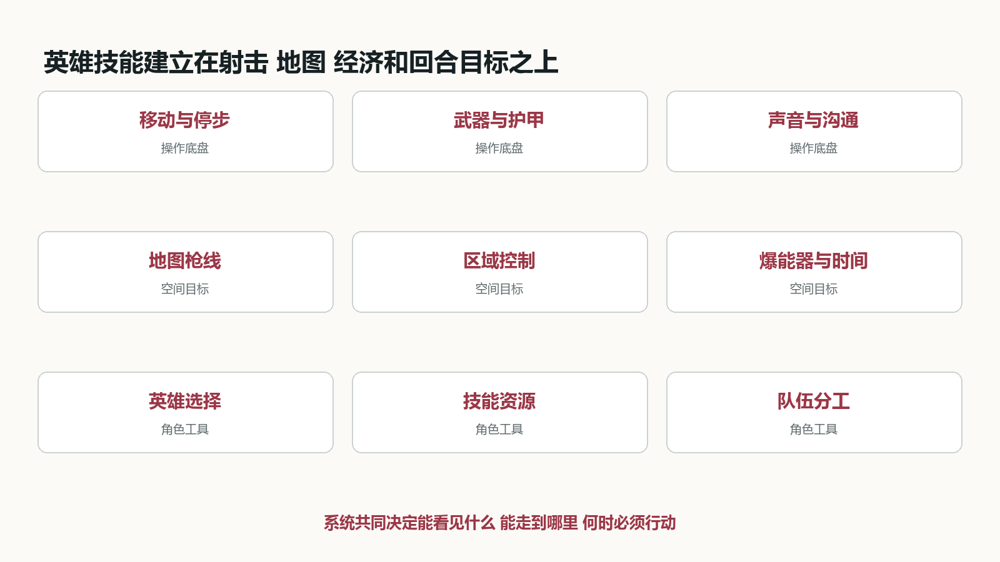
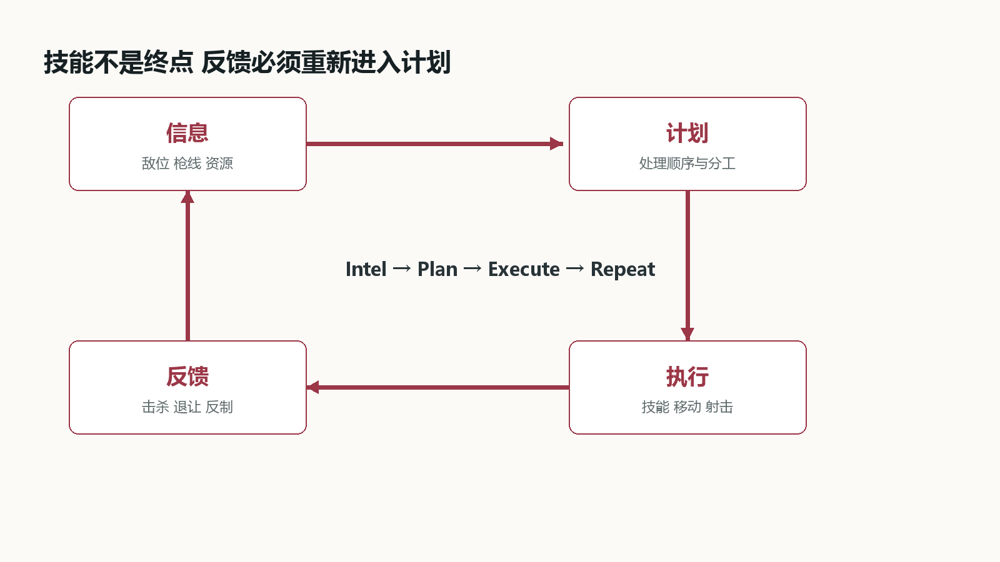
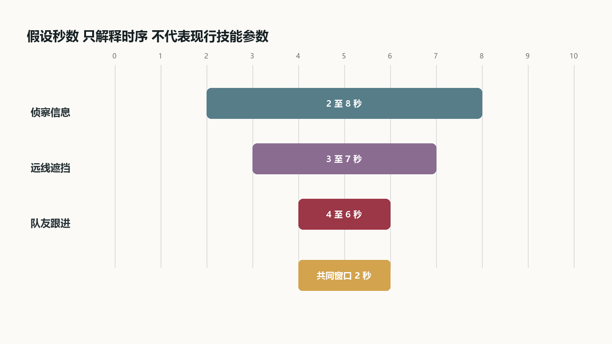
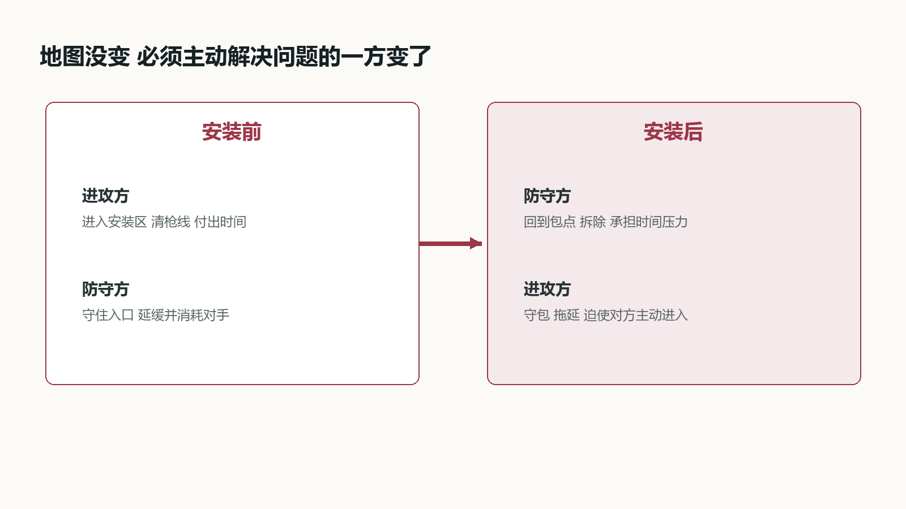

# VALORANT战术系统分析

从停步开枪到五人进点 英雄技能怎样改变信息 空间与节奏

## 01 游戏概览与分析口径

《VALORANT》的标准爆破模式把精确射击、回合经济、地图控制和英雄技能压进同一轮攻防。进攻方争取安装爆能器并保护其引爆，防守方阻止安装或在安装后拆除；双方在半场交换阵营。购买阶段决定本回合能带什么，选人阶段决定队伍拥有哪些独特工具。[V2]

这份分析不做全英雄技能百科，也不把角色按伤害高低排队。我想回答的是：英雄技能究竟改变了 FPS 的哪一部分。结论先写在前面——它们大多先改变信息、视野、通路或行动时机，再由玩家用移动和射击兑现；技能释放成功、队伍获得优势、最终赢下交战，是三个不同结果。

文章先交代射击、地图和经济这层共同底盘，再把 Sova、Omen、Jett 与 Cypher 的代表技能拆成输入、判定、反馈和后续行动。后半部分通过进点时间轴、防守反制和安装后的目标反转，说明“FPS 加 MOBA 元素”这句话具体落在哪里，又到哪里为止。

## 02 系统全景 一回合如何成立

从系统结构看，比赛由四层互相约束。底层是移动、停步、瞄准和武器精度；空间层是地图通路、掩体、枪线和安装区；资源层是信用点、武器、护甲与技能购买；角色层是英雄独有工具和队伍分工。爆能器与回合时间把四层拉到同一个目标上。[V2]

任何一层掉链子，战术都可能失效。技能拿到了信息，但队友尚未到入口，信息会过期；烟封住远线，近点没有人清，第一名进攻者仍会倒下；队伍取得人数优势，却在包已经安装后离开可守位置，优势也可能被时间收回。

Riot 把健康的战术循环概括为 Intel、Plan、Execute、Repeat。[V1] 这不是抽象口号：信息必须能改变计划，计划必须落实到谁在什么时刻处理哪条枪线，执行后的新反馈又要让队伍更新下一步。

图 标准爆破的系统全景。图中关系为本文归纳，不是客户端内部架构。

## 03 射击底盘 技能不能替代最后一枪

官方入门说明直接提醒玩家停下移动再射击，并把武器选择同距离、打法和队伍策略联系起来。[V2] 这决定了技能再复杂，最后仍要回到准星、停步、预瞄和补枪。烟幕让一条远线暂时不可见，并不会替玩家清掉近点；侦察显示一个目标，也不会让子弹自动命中。

地图把这种射击要求变成空间问题。入口同时暴露给几个角度时，首人无法把准星放在所有位置；掩体、高低差和转角让防守者能够预置准星。技能的常见价值，是把“同时处理三个方向”改成“先处理一个，再处理另一个”，或者逼防守者离开原本最舒服的位置。

因此评价技能不能只看命中率或伤害。更实用的检查是：它减少了哪一条枪线，迫使谁移动，给使用者留下多少收枪时间，队友是否能在效果结束前进入。技能改变交战条件，枪法把这些条件兑现。

## 04 回合与经济 一次购买也是战术选择

购买阶段让队伍用有限信用点选择武器、护甲和部分技能。玩家并非每轮都能买到理想配置，上一回合的结果会通过经济继续影响下一回合。[V2] 队伍要同时考虑眼前战斗力和之后能否形成一次整齐的完整购买。

同样是经济劣势，可以有不同打法。短枪和霰弹枪可能推动队伍借烟缩短距离，低投入回合也可能围绕多人同角、近点埋伏或抢一把枪展开。若五个人各自购买、没有共同计划，问题不只是装备参差，而是站位和预期交战距离也不一致。

英雄技能让经济决策多一层取舍：一项技能是否值得牺牲更好的武器，取决于本轮计划里它能解决什么。如果队伍没有打算争夺对应区域，买下却不用只是库存清零；如果它正好让低成本武器避开不利长枪线，技能的价值又不能只按直接伤害计算。

## 05 先把技能接到回合与资源上

英雄决定可用工具，购买与充能决定本轮能用多少，位置与时机决定这次能不能用好。三层条件不能混为一谈。

### 回合前的取舍

官方入门介绍明确把武器和技能放在购买准备中。玩家不只是在选强枪，也在为队伍准备本轮所需的工具。具体技能可能采用购买、签名技能恢复或终极点数等不同方式，不能一律理解为“等冷却就能再放”。

### 进入交火后的约束

切出技能、选择落点和收回武器都有操作过程。技能能成功释放，不代表使用者此时适合直接接枪。队友提供架枪保护，可以让某些在单人状态下冒险的操作变得可行。

### 回合内还会重新计划

拿到新信息、有人阵亡或目标转移后，原定进点方案可能不再成立。Riot 的战术循环包含收集信息、计划、执行和重复；本文把它具体落实为检查目标、资源和可行动队友的状态变化。

图表：资源与规则接口，不是客户端内部代码

|层级|需要检查|常见误解|
|---|---|---|
|英雄选择|这名角色拥有哪些工具|每个角色都能补同一份缺口|
|购买与充能|本轮可用数量 / 获取规则|所有技能都是固定冷却|
|释放条件|距离 / 落点 / 自身状态|按键成功就已经有收益|
|作用阶段|敌人是否处在判定范围|视觉范围等于实际命中范围|
|后续行动|队友位置 / 收枪 / 目标变化|技能放完就算配合完成|

系统分析的最小单位不是技能名称，而是“在什么条件下，哪个输入会让哪些状态发生变化”。

来源：V1、V2

图 信息到执行的回合循环。图中关系为本文归纳，不是客户端内部架构。

## 06 四个角色，拆成四种不同的输出

职能标签适合帮助选人，到了交战层面，还需要区分技能究竟改变了什么。相同职能也不意味着相同判定。

### 信息与视野不是一回事

Sova 的侦察箭帮助获取敌人位置；Omen 的烟雾减少某方向可见内容。前者可能让人知道该看哪里，后者让一条枪线暂时难以观察。烟雾不能顺便证明烟后没人，侦察也不能替代遮挡。

### 角色之间会有功能交叉

Omen 还拥有影响对方视野范围的工具，不能把控场者的全部技能都归成烟。Cypher 的装置既提供线索也干扰经过者。分类用于描述主要输出，不是限制角色只能做一种事情。

### 范围刻意收窄

后续只深拆四个代表技能，不逐个抄全技能说明。这样才能保留输入条件、反制和失效情况。若扩到新英雄，应沿用这些检查项，再核验该技能的例外。

图表：代表技能的输入与输出

|技能|玩家输入|主要输出|不能保证|
|---|---|---|---|
|Sova 侦察箭|角度 / 蓄力 / 反弹|满足判定的敌位线索|所有角落被清空|
|Omen 烟雾|目标位置与高度|局部视野遮挡|通路物理封死|
|Jett 位移|预激活与方向|改变自身位置|队友同步进入|
|Cypher 绊线|布设位置与高度|经过触发的警戒|整条侧翼持续安全|

这一层拆得清楚，后面的配合分析才不会把所有技能都写成模糊的“控场”和“创造机会”。

来源：V3、V4、V5、V6

## 07 Sova：没扫到人，不等于点里没人

侦察箭有落点、有视线条件，也能被摧毁。它返回的是一次受条件限制的结果，不是一张包点安全证明。

### 输入与判定

官方技能说明包含蓄力、最多两次反弹、碰撞后激活；敌人需要处于箭的视线判定下才会暴露，箭本身可以被摧毁。本文不额外假定隔墙也能探测，也不从箭的落点动画直接推算整个有效覆盖区。

### 三个输出应分开处理

出现敌人反馈，可以据此调整预瞄；箭被快速摧毁，能确认工具被处理，却不能反推出完整敌位；没有任何目标反馈，仍可能存在未覆盖角落。三种结果不能统一解释成“扫完，走”。

### 协作发生在结果之后

设一名敌人躲在箱后，另一名处于箭的视线内。进攻者若只盯被标记的人，就会漏掉箱后位置。队伍需要明确谁处理已知目标、谁检查未知角，而不是全员追着同一个轮廓移动。

图表：侦察箭的可观察状态

1. 装备并发射：落点来自角度、蓄力与反弹

2. 碰撞激活：进入侦察作用阶段

3. 结果分支：目标反馈 / 被摧毁 / 无目标反馈

4. 更新计划：处理已知目标，同时保留未覆盖角

拆解信息技能，要同时写出它告诉玩家什么，以及它没有资格告诉玩家什么。

来源：V3

## 08 Omen：烟封得住枪线，也可能帮对手出烟

以一个假设入口为例：进攻者需要同时应对左侧近点和后方远线。把远线遮住，可以减少第一时间的检查方向。

### 作用对象是视野

官方技能页描述烟雾在指定位置形成遮挡视线的球体。烟不会替队伍处理所有敌人。入口附近仍可能有人，烟后也可能有人推进，队伍必须安排准星与站位接住这些变化。

### 落点决定谁利用边界

如果烟伸出出口较多，对手可能从烟的不同边缘出现，进攻者要处理的出烟角会扩大。若烟贴合预期封锁口，出烟方向更集中。图只表达这个几何关系，不提供可直接照抄的地图点位。

### 历史改动关注几何反制

9.10 限制 Omen 烟雾落在某些装饰几何上，要求落至可站立的关卡表面，以减少低反制的单向烟。它说明落点规则本身就是平衡参数，但不能概括为“从此没有任何单向烟”。

图表：自绘枪线示意 / 非真实地图比例

看烟的质量，要看它改变了双方哪些观察角与出烟选择，不只看它有没有覆盖到门口。

来源：V4、V8

## 09 Jett：用状态机拆开“能冲”和“来得及冲”

Jett 的历史调整没有简单删除位移，而是在使用前加入承诺，并缩短可以等待机会的时间。

### 4.08：先决定要用，再等机会

该版本将 Tailwind 改为消耗次数后进入 0.75 秒启动，再获得 12 秒可执行位移的窗口。它让使用者提前表态，不再把全部决定留到遭遇危险的一瞬间。这里展示历史状态，不作为当前版本参数。

### 7.04：缩短等待空间

窗口由 12 秒改为 7.5 秒，启动由 0.75 秒改为 1 秒。官方意图是保留主动破点，同时减少防守架枪与反应式撤错能力。改的是机会窗口，并不是简单降低位移距离。

### 输入成功与战术成功分离

进场位置正确，但队友仍在切技能，Jett 就可能单独面对多人。位移把她送到了新位置，却没有把队伍一起送过去。复盘时应分别检查启动是否过早、路线是否合理，以及第二人是否具备补枪条件。

图表：历史机制状态 / 7.04 参数快照

1. 可用：玩家决定是否投入本次技能

2. 预激活 1 秒：还不能把它当作即时逃生

3. 有效窗口 7.5 秒：再次输入执行位移，或等待过期

4. 执行或失效：检查落点和队友跟进，而非只看位移完成

如果一个技能同时服务进攻和撤退，可以先检查时间条件，未必需要直接删除其中一种玩法。

来源：V6、V7

## 10 Cypher：装置警戒不能自动替代一个队友

把侧翼的一部分警戒交给装置，可以让玩家把视线转向正面。但这个收益依赖装置覆盖和反馈仍然可信。

### 先区分事件和持续状态

绊线触发代表有人触及判定；绊线被摧毁代表原有布设失效。它们是不同事件。装置还在，也只能说明没有触发对应事件，不能证明一整片区域无敌人。

### 信息失效要重新分工

若负责正面的玩家得知后方绊线被处理，队伍应重新安排看后路的人，或改变推进速度。继续沿用“后面有人看”的假设，会把本来节省注意力的工具变成盲区。

### 适用范围

官方说明支持绊线可布设、可摧毁及触发后的限制效果。本文不把装置触发时间、重新生效时间或阵亡后的机制写成现行参数。不同英雄的装置与死后技能例外，需要单独核验。

图表：从装置信号到队伍动作

|可观察信号|合理解读|队伍动作|
|---|---|---|
|未触发|此布设尚未报告经过者|保持原计划，但不宣称全侧安全|
|发生触发|对应位置出现受影响目标|指定一人处理，其他人保正面|
|被摧毁|原有警戒条件不再成立|重新分配后路视线|
|路线改变|装置与当前目标可能脱节|重新判断布设是否仍相关|
|队友没听到反馈|团队信息未同步|补一次清楚报点，避免重复吵杂|

辅助技能的价值常体现在队伍能把注意力转到哪里；这个转移应当随着装置失效而撤回。

来源：V5

## 11 进点时间轴：有效窗口必须真的重叠

以下秒数完全自设，只用于演算。假设侦察结果、远线遮挡和队友跟进各有一段有效时间；它们单独存在，不代表配合成立。

### 定义一个可检查条件

把三段区间记为 I、S、T，重叠长度 W=max(0,min(结束时刻)-max(开始时刻))。这只是检查时序的工具，不是游戏内公式。若 W 为零，就没有同时满足这三个前提的时段。

### 按图计算

假设信息可用为第 2 至 8 秒，烟雾服务入口为第 3 至 7 秒，队友能跟进为第 4 至 6 秒，重叠是第 4 至 6 秒，共 2 秒。若队友第 7 秒才就位，重叠变为零。技能都放对，也可能没有配合窗口。

### 为什么重叠仍不等于成功

W 大于零只表示几个前提同时具备。未知近点、对方延缓技能、切枪时间和玩家瞄准仍可能让推进失败。进攻指令应根据实际反馈确认，不应只靠倒数把人送进去。

图表：假设进点时序 / 不是技能真实持续时间

复盘可先问“第二个人到入口时，前面交出的工具还有效吗？”这比笼统说队友不配合更容易定位问题。

来源：本文模型 / 假设推演

图 三段条件的进点重叠窗口。图中关系为本文归纳，不是客户端内部架构。

## 12 从防守方看：让对方的技能分开生效

上一节的进攻依赖时序重叠。防守方不一定需要一次性打赢所有工具，也可以让它们错开。

### 有反馈时重新判断

侦察被处理后，进攻方失去计划中的信息前提；入口被延缓后，烟可能已经消耗一段时间；第一人进场但第二人被挡在外面，补枪条件也随之改变。此时继续原计划的风险已经不同。

### 取消进点也是有效决策

若时间允许，收回前压、补充线索或换方向，可能比硬走更合理。若回合时间紧迫，就需要接受不完整条件下的推进。拆解不能只写理想连招，还要说明什么时候退出和什么时候必须承担风险。

### 不要归咎一个角色

烟消失可能是交得太早，也可能是入口突然被阻断。Jett 单独阵亡可能是自身脱节，也可能是后续队友受到新威胁。先还原事件顺序，再判断责任，避免把结果倒推成固定的人物问题。

图表：进点故障定位表

|出现的问题|被破坏的前提|可选应对|
|---|---|---|
|侦察刚落就被处理|预定信息缺失|人工清角 / 换信息工具|
|队友入口受阻|跟进窗口后移|等队友 / 重组技能 / 改方向|
|烟结束时才推进|远线重新开放|补遮挡或重新处理远线|
|只追标记目标|未知近点未检查|重新分配清角任务|
|侧翼警戒失效|后路安全假设取消|留人警戒或缩短行动|

分析的价值也包括解释失败。一个只在敌人不反应时才成立的技能顺序，不足以成为战术说明。

来源：本文模型 / 假设推演

## 13 安装之后 着急的一方换了

安装爆能器之前，进攻方需要在回合时间内进入安装区，防守方可以利用枪线和延缓工具让对手继续付出时间。安装完成以后，目标关系反转：防守方必须回来拆除，进攻方反而可以退到能看住爆能器或回防通路的位置。

这个变化会重新定义好位置。进点时有价值的近处掩体，守包时未必能覆盖拆除；为了追击一名后退的防守者离开交叉火力，也可能把本来由目标带来的时间优势交还给对方。击杀仍然重要，但它服务于目标，而不是凌驾于目标。

技能储备也因此有阶段价值。进点烟用于让队伍穿过危险枪线，守包的遮挡或区域限制则用于拖慢回防。不能把“留技能”写成固定美德：如果前面少一个必要工具就进不了点，后续价值不会出现；已经取得稳定位置后继续一次性交完技能，也可能浪费原本能分段拖延的时间。

复盘一轮攻防时，应把安装前后分开：谁在承担时间压力、技能解决的是进入还是拖延、队伍是否围绕爆能器重新站位。这样才能解释看似相同的一颗烟，为什么在两个阶段承担完全不同的任务。

图 安装前后目标与时间压力反转。图中关系为本文归纳，不是客户端内部架构。

## 14 与 CS2 比，区别在工具分配和回合内依赖

两款游戏都需要信息、遮挡、时机和枪法。“CS 没有技能，所以没有这些策略”是错误的比较起点。

### 共同部分

两者都可以通过烟雾改变枪线，通过队友补枪降低首人风险。CS2 烟雾还会响应枪火和爆炸，不能把它描述成完全静态的遮挡球。比较应先承认这些共享问题，再看解决手段如何组织。

### VALORANT 增加的约束

代表英雄的工具与角色绑定，队伍的补位并不总能替代原有技能。购买、签名技能与终极资源又形成不同时间条件。某个工具使用者失去行动能力后，计划要按具体技能规则重算，而不是假设其他人都能补同样一颗道具。

### MOBA 类比到哪里为止

英雄分工与技能协作让这个类比有用，但本文的进点样本没有依赖局内升级、对线发育或装备成长曲线。交战仍需处理枪线、准星和短时间内的执行。用“工具分配不同”解释，比只贴融合标签更精确。

图表：比较对象：常规团队战术，不是所有特殊模式

|问题|CS2|VALORANT 代表样本|
|---|---|---|
|谁能承担遮挡|通用道具围绕购买与携带安排|工具受所选英雄限制|
|如何改变信息|声音、视野、道具试探等|还有显式侦察与装置反馈|
|什么时候重来|剩余道具与回合状态|还需核对各技能恢复方式|
|队友失去行动能力|重新分配现有人员与道具|还可能失去特定英雄工具|
|胜负如何兑现|射击、站位与目标行动|同样需要，技能改变前提|

角色绑定让队伍更依赖特定工具的使用者；通用工具更便于围绕资源重新分工。两者都仍然需要协作。

来源：V2、V9

## 15 把理解变成能验证的用例

下面是自定义对局的拟验收用例，不是已完成的测试结果。每项先固定条件，再观察是否符合本文的机制理解。

### 执行方法

固定地图版本与双方位置，记录操作时间、画面反馈、站位变化及失败原因。每个用例重复三次只能排查偶发操作，不足以估算胜率。历史 Jett 数值不能在当前客户端直接回测，应使用对应版本录像或只验证现行状态。

### 先测机制，再测配合

先确认侦察是否覆盖目标、装置能否反馈，随后再增加队友和敌方反应。否则一次失败同时混入落点误差、信息误读与跟进迟缓，很难判断究竟哪条规则出了问题。

### 回到文档

若实际表现与预期不符，先检查客户端版本和操作，再修正文档。知识库提供了输入、判定、反馈和边界的检查方法，不提供这几款技能的实际参数。本文不把模板当作机制证据。

图表：6 组对照，合计 12 个情形 / 待执行

|对照组|变化条件|记录重点|
|---|---|---|
|侦察覆盖|目标在箭视线内 / 被实体遮挡|有无位置反馈|
|侦察存续|箭未处理 / 作用前被摧毁|信息是否仍然成立|
|烟雾落点|贴封锁口 / 向外突出|出烟角度与可见枪线|
|位移状态|尚未就绪 / 已进入可用窗口|输入结果与反馈是否清楚|
|侧翼装置|布设完好 / 已被摧毁|队友是否重新分配警戒|
|进点跟进|窗口内到位 / 窗口后到位|第二人有无有效补枪条件|

能写出对照条件和预期反馈，才说明已经把“技能有战术价值”推进到了可检查的理解。

来源：V3、V4、V5、V6

## 16 分析结论与资料索引

四个技能形成的不是必胜连招，而是一组需要持续检查的条件：信息是否还可信、枪线是否被处理、队友是否来得及跟进。

### 可以带走的判断

一次进点失败，不一定是技能交少了。也可能是几段效果没有重叠，或团队把局部信息误当成整体安全。拆输入、判定、反馈、后续行动，能够把这些原因逐项分开。

### 仍缺的证据

本文尚无真实对局录像逐帧复盘，不能评价某套组合的胜率，也不能证明某玩家操作错误。图中的位置和秒数是解释模型。面试时应把规则事实、历史改动与推演明确区分。

### 知识库使用记录

按需参考 00-方法论中的输入/处理/输出与异常边界，以及 01-战斗系统中的前瞻决策、反馈与风险收益。没有遍历案例库，也没有把其他类型游戏的数值套到战术射击。

图表：官方资料 / 历史改动不充当现行参数

最重要的区分：技能释放成功、队伍形成优势、最终赢下交战，是三个需要分别解释的结果。

来源：V1、V2、V3、V4、V5、V6、V7、V8、V9
